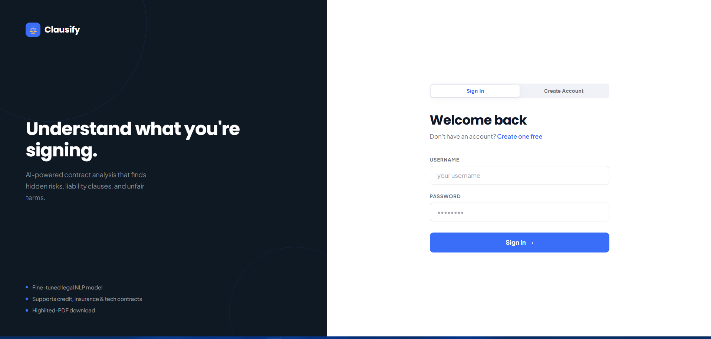
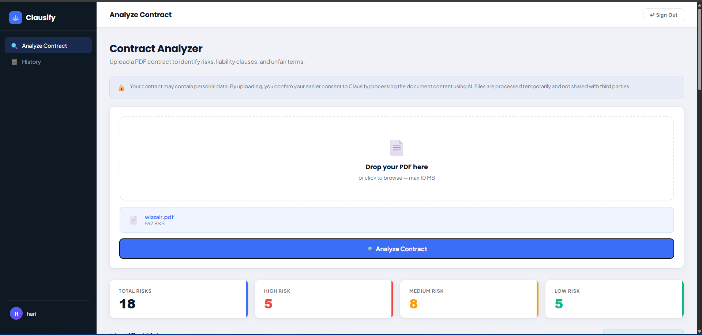
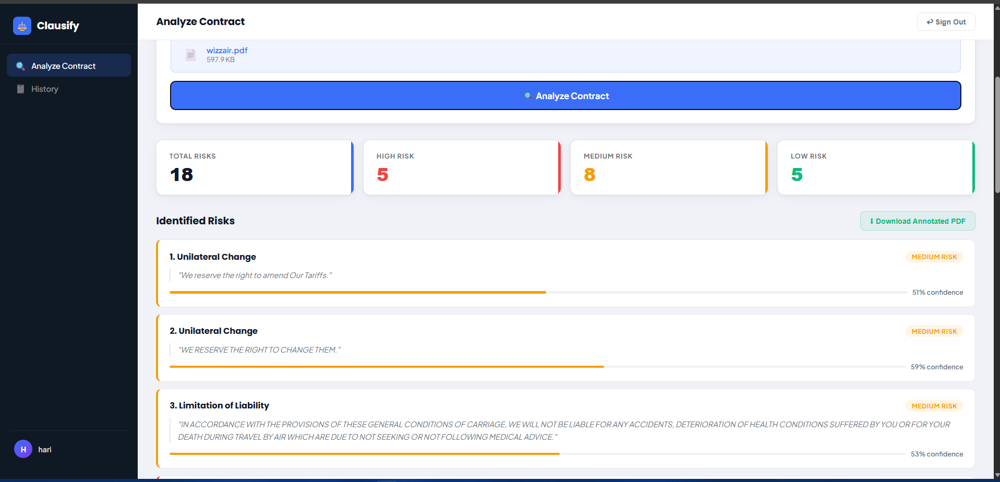

# Clausify — AI-Powered Contract Risk Analyzer

Clausify is a full-stack web application that automatically detects risky clauses in legal contracts using a fine-tuned legal NLP model. Upload a PDF contract and get an instant breakdown of risk categories, confidence scores, and the exact clause text that triggered each flag.

**Live Demo:** https://contractanalyzerapp-production.up.railway.app

**Demo Video:** Coming soon

---

## Screenshots

### Login Page


### Contract Upload


### Risk Analysis Results


---

## Features

- **AI Risk Detection** — Fine-tuned legal transformer on LexGLUE `unfair_tos`, achieving **77.2% weighted F1 score** across 8 contract risk categories
- **Secure Authentication** — JWT-based auth with bcrypt password hashing and server-side password validation
- **Automatic File Cleanup** — Analyzed PDFs deleted immediately after download or on logout
- **User Consent** — Explicit consent collected at signup since the app processes personal documents
- **Rate Limiting** — Brute force protection on authentication endpoints
- **CI Pipeline** — GitHub Actions runs pytest on every push
- **Dockerized** — Containerized for consistent deployment

---

## Tech Stack

| Layer | Technology |
|-------|-----------|
| Backend | FastAPI |
| Database | PostgreSQL via Supabase |
| ORM | SQLAlchemy |
| Authentication | JWT (PyJWT) |
| Password Hashing | bcrypt + passlib |
| NLP Model | HuggingFace Transformers |
| Training Data | LexGLUE `unfair_tos` dataset |
| PDF Processing | pdfplumber + PyMuPDF |
| Testing | pytest |
| CI | GitHub Actions |
| Containerization | Docker |
| Deployment | Railway |

---

## Model Performance

Evaluated on the LexGLUE `unfair_tos` test split (1,607 examples):

| Metric | Score |
|--------|-------|
| Weighted F1 | **77.2%** |
| Weighted Precision | 83.7% |
| Weighted Recall | 72.0% |
| Exact Match Accuracy | 95.5% |

**Per-class breakdown:**

| Risk Category | F1 Score |
|---------------|----------|
| Choice of Law | 96% |
| Arbitration | 86% |
| Contract by Using | 84% |
| Limitation of Liability | 76% |
| Jurisdiction | 77% |
| Content Removal | 75% |
| Unilateral Change | 72% |
| Unilateral Termination | 72% |

---

## Project Structure

```
ContractAnalyzerApp/
├── api.py                  # FastAPI backend — all endpoints
├── database.py             # SQLAlchemy models (User, SearchHistory)
├── processpdf.py           # PDF processing + NLP model inference
├── evaluate.py             # Model evaluation script (LexGLUE benchmark)
├── frontend.html           # Frontend — single file SaaS UI
├── test_api.py             # pytest test suite (8 tests)
├── conftest.py             # pytest fixtures and test database setup
├── Dockerfile              # Docker container configuration
├── .dockerignore           # Files excluded from Docker build
├── requirements.txt        # Production dependencies
├── requirements-test.txt   # CI/testing dependencies (excludes torch)
├── .github/
│   └── workflows/
│       └── test.yml        # GitHub Actions CI pipeline
└── .env                    # Environment variables (not committed)
```

---

## API Endpoints

| Method | Endpoint | Auth | Description |
|--------|----------|------|-------------|
| GET | `/` | No | Serves the frontend |
| POST | `/signup/` | No | Register a new user |
| POST | `/login` | No | Login and receive JWT token |
| POST | `/analyze/` | Yes | Upload PDF and get risk analysis |
| GET | `/download/{filename}` | Yes | Download annotated PDF (deleted after serving) |
| GET | `/history/` | Yes | Get past analyses for current user |
| POST | `/logout` | Yes | Logout and delete any leftover files |

---

## Security Features

- **JWT Authentication** — all sensitive endpoints require a valid token
- **File Ownership Check** — users can only download their own files
- **Path Traversal Protection** — prevents `../../` attacks on file endpoints
- **Input Validation** — PDF-only uploads, 10MB size limit
- **Rate Limiting** — authentication endpoints protected against brute force
- **Secrets Management** — all credentials stored in environment variables, never committed

---

## Running Locally

**Prerequisites:** Python 3.11+, a Supabase account

**1. Clone the repo:**
```bash
git clone https://github.com/Hari2004761/Contract_AnalyzerApp.git
cd Contract_AnalyzerApp
```

**2. Create a virtual environment:**
```bash
python -m venv .venv
.venv\Scripts\activate      # Windows
source .venv/bin/activate   # Mac/Linux
```

**3. Install dependencies:**
```bash
pip install -r requirements.txt
```

**4. Set up environment variables:**

Create a `.env` file in the project root:
```
SECRET_KEY=your_secret_key_here
DATABASE_URL=your_supabase_connection_string
ALGORITHM=HS256
HF_TOKEN=your_huggingface_token
```

**5. Run the backend:**
```bash
uvicorn api:app --reload
```

**6. Open the frontend:**

Visit `http://localhost:8000` in your browser.

---

## Running with Docker

**1. Build the image:**
```bash
docker build \
  --build-arg SECRET_KEY=your_secret_key \
  --build-arg DATABASE_URL=your_supabase_url \
  --build-arg HF_TOKEN=your_huggingface_token \
  -t clausify .
```

**2. Run the container:**
```bash
docker run -p 8000:8000 clausify
```

**3. Visit:** `http://localhost:8000`

---

## Running Tests

```bash
pip install -r requirements-test.txt
pytest test_api.py -v
```

**Test coverage:**

| # | Test | What it checks |
|---|------|----------------|
| 1 | `test_signup_new_user` | New user signup returns 200 |
| 2 | `test_signup_duplicate_username` | Duplicate username returns 400 |
| 3 | `test_login_correct_credentials` | Correct login returns JWT token |
| 4 | `test_login_wrong_password` | Wrong password returns 401 |
| 5 | `test_analyze_no_authorization_header` | Missing token returns 401 |
| 6 | `test_analyze_with_valid_token` | Valid upload returns risks and download URL |
| 7 | `test_download_own_file` | Owner can download their file |
| 8 | `test_download_other_users_file` | User cannot download another user's file (403) |

---

## CI/CD

GitHub Actions automatically runs the full test suite on every push to `main`. The CI pipeline uses SQLite in-memory as the test database so Supabase is never touched during testing. Railway automatically redeploys on every push to `main` when tests pass.

[](https://github.com/Hari2004761/Contract_AnalyzerApp/actions/workflows/test.yml)
